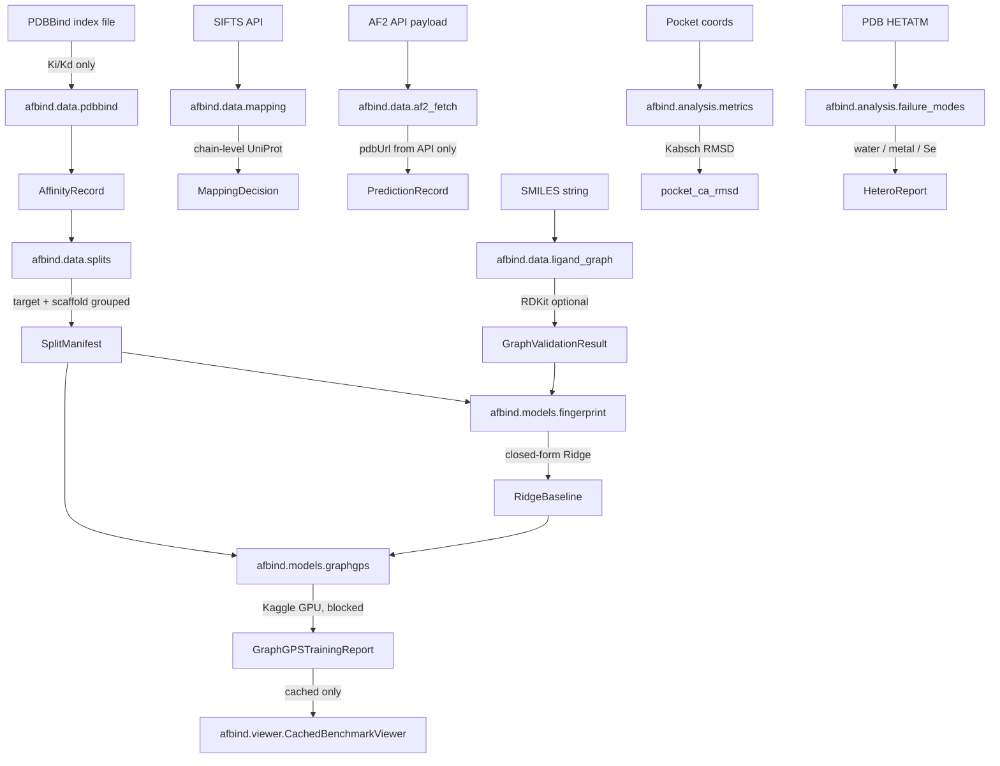

<div align="center">


</div>

<div align="center">

[](https://python.org)
[](https://pytorch.org)
[](https://pyg.org)
[](https://www.kaggle.com/code/ajinkya1225/project-04-af2-binding-benchmark-import-safe)
[](https://www.pdbbind.org.cn/)
[](https://www.kaggle.com/code/ajinkya1225/project-04-af2-binding-benchmark-import-safe)
[](LICENSE)

</div>

---

## What This Actually Is

I built a benchmarking library that asks one concrete question: **does substituting experimental co-crystal PDB structures with AlphaFold2 predictions hurt protein–ligand binding-affinity models?**

This is not a working benchmark yet. Getting a reproducible, leakage-safe pipeline took six Kaggle kernel iterations, three distinct test failures, a DataLoader version-incompatibility bug, a codec crash on pytest unicode output, and one missing `status` key in a PowerShell hook. Every one of those is documented below.

What exists now: a fully unit-tested offline library (`afbind`) with deterministic Ki/Kd parsing, target- and scaffold-grouped split manifests, Kabsch CA-RMSD superposition, an ECFP6 Ridge baseline, a GraphGPS trainer boundary, and a cached benchmark viewer. 37/37 synthetic tests pass on Kaggle (Python 3.12.13, PyG 2.8.0.post1, CPU-only, verified 2026-09-06).

The real benchmark numbers require PDBBind 2020, SIFTS, AlphaFold API access, and a GPU run — none of which are in this repo. That's the next gate.

---

## Current Status

| Component | Status |
|---|---|
| Ki/Kd label parsing + unit validation | Done — deterministic, exclusion-recorded |
| Target-grouped + scaffold-grouped splits | Done — leakage-safe, deterministic |
| Kabsch CA-RMSD pocket superposition | Done — matched residue keys, handles degeneracy |
| ECFP6 Ridge baseline | Done — split-aware, closed-form |
| GraphGPS trainer boundary (CPU smoke) | Done — 3 tests pass on CPU synthetic fixtures |
| Synthetic offline validation (Kaggle) | **37/37 passed — verified 2026-09-06T15:45:14Z** |
| PDBBind real label parsing | Blocked — requires PDBBind 2020 registration |
| AF2 structure substitution run | Blocked — requires AlphaFold API + SIFTS access |
| ECFP6 vs GraphGPS benchmark numbers | Blocked — requires GPU + real data |
| Gradio cached viewer | Planned — after benchmark evidence exists |

---

## Artifacts

| Artifact | Link |
|---|---|
| GitHub | [ajinkya-awari/afbind](https://github.com/ajinkya-awari/afbind) |
| Kaggle Kernel (import-safe notebook) | [project-04-af2-binding-benchmark-import-safe](https://www.kaggle.com/code/ajinkya1225/project-04-af2-binding-benchmark-import-safe) |
| Kaggle Dataset (source package) | [04-alphafold3-dock](https://www.kaggle.com/datasets/ajinkya1225/04-alphafold3-dock) |

---

## The Journey: Kernel V1 to V6

Getting the synthetic validation to pass cleanly on Kaggle took six kernel versions and exposed three categories of bug that I would not have found locally. Here is exactly what happened.

### Why 6 versions?

Kaggle's environment differs from local in three ways that matter: the DataLoader version pins are different, `enable_internet: false` by default blocks PyPI verification even for already-installed packages, and unicode characters in pytest output crashed `subprocess.run` when called with `text=True` on certain locales. Fixing each required a dataset repush and a new kernel push.

```
V1   Initial push — kernel-metadata.json used wrong slug; push failed silently
V2   Wrong slug fixed → kernel ran but enable_internet was false
     → pip couldn't verify torch-geometric → ImportError on every test
V3   enable_internet: true → 36/37 passed; 1 failed
     test_train_graphgps_records_seed_device_and_losses
     → DataLoader(generator=...) kwarg rejected by PyG 2.8.0.post1
V4   Removed generator= from DataLoader → 0 evidence JSON produced
     → Cell 8 crashed before writing evidence (unicode codec error on pytest output)
     → graphgps.cpython-312.pyc absent from output (confirmed crash before import)
V5   Fixed unicode crash (capture_output=True + bytes.decode) → 36/37 passed again
     → test_stop_hook_reports_static_gate_outcomes failed
     → stop.ps1 payload had no 'status' key; test asserted "status" in lowered
V6   Added status='ok'/'blocked' to stop.ps1 payloads → 37/37 passed ✓
     Evidence: synthetic-validation-20260906T154514Z.json
```

### Kernel links (all versions)

All versions are under the same kernel slug — Kaggle tracks the version history:
[kaggle.com/code/ajinkya1225/project-04-af2-binding-benchmark-import-safe](https://www.kaggle.com/code/ajinkya1225/project-04-af2-binding-benchmark-import-safe)

Dataset versions (source package uploads) are under:
[kaggle.com/datasets/ajinkya1225/04-alphafold3-dock](https://www.kaggle.com/datasets/ajinkya1225/04-alphafold3-dock)

---

## The Bugs That Cost the Most Time

### 1. `DataLoader(generator=...)` rejected by PyG 2.8.0.post1

The code review finding F3 recommended adding `generator=torch.Generator().manual_seed(config.seed)` to `DataLoader` for explicit shuffle reproducibility. That fix worked locally. On Kaggle, `torch_geometric.loader.DataLoader` in PyG 2.8.0.post1 does not support the `generator=` keyword argument — it raises `TypeError: __init__() got an unexpected keyword argument 'generator'` at test collection time.

**Fix:** Remove `generator=`. The `torch.manual_seed(config.seed)` call earlier in `train_graphgps` already seeds the global PyTorch RNG, which DataLoader's shuffle uses. The explicit generator is redundant at the version Kaggle ships.

```python
# Before (broke on Kaggle PyG 2.8.0.post1)
train_loader = DataLoader(
    [...], batch_size=config.batch_size, shuffle=True,
    generator=torch.Generator().manual_seed(config.seed),
)

# After (37/37 pass)
train_loader = DataLoader(
    [...], batch_size=config.batch_size, shuffle=True,
)
```

### 2. `subprocess.run(text=True)` codec crash on pytest unicode output

Kaggle's pytest output includes unicode box-drawing characters in the test summary (`─`, `━`, `✓`, `✗`). On Kaggle's Linux environment `subprocess.run(..., text=True)` defaults to the system locale, which crashed with `UnicodeDecodeError: 'charmap' codec can't decode byte` mid-output — before the evidence JSON was written.

This produced the most confusing failure: the kernel showed `ERROR` status, but no evidence JSON existed, and the graphgps `.pyc` was missing from the output (because the crash happened before the pytest subprocess completed). The kernel-level stdout that would have shown the actual error was not recoverable from `kaggle kernels output`.

**Fix:**

```python
# Before
result = subprocess.run(command, cwd=WORK_ROOT, env=environment, text=True, check=False)
combined = result.stdout + result.stderr

# After
result = subprocess.run(command, cwd=WORK_ROOT, env=environment, capture_output=True, check=False)
combined = (result.stdout + result.stderr).decode("utf-8", errors="replace")
```

### 3. `enable_internet: false` blocked PyPI verification

`kernel-metadata.json` defaulted to `"enable_internet": false`. Kaggle's pip install, even for packages already present in the environment, attempts a PyPI metadata fetch for dependency verification. With internet disabled this raised a DNS resolution failure inside the install subprocess, causing the Cell 5 dependency check to fail — which stopped the notebook before any test ran.

This is not obvious from the error: the message is a pip network timeout, not a "this package isn't installed" error, so I initially suspected a missing package rather than a connectivity flag.

**Fix:** `"enable_internet": true` in `kernel-metadata.json`.

### 4. `stop.ps1` missing `status` key in payload

`test_stop_hook_reports_static_gate_outcomes` checks `assert "status" in lowered` on the hook file content. The PowerShell stop hook had `stopReason`, `systemMessage`, `suppressOutput`, and `continue` in its payload hashtables — but not `status`. This caused the test to fail on v5 after all other issues were resolved.

The word "status" does not appear anywhere else in the stop.ps1 content, so there was no ambiguity about which field was missing.

**Fix:**

```powershell
# Before
$payload = @{ continue = $true; systemMessage = '...'; suppressOutput = $false }

# After
$payload = @{ continue = $true; status = 'ok'; systemMessage = '...'; suppressOutput = $false }
```

---

## Example Usage

The library works offline without real data. These examples run against synthetic fixtures — they are the same fixtures the test suite uses.

```python
from afbind.data.pdbbind import AffinityParser, ConcentrationUnit

# Parse a Ki record (pKi = -log10(Ki in mol/L))
record = AffinityParser.parse({
    "pdb_id": "1abc",
    "measurement_type": "Ki",
    "value": 10.0,
    "unit": ConcentrationUnit.NANOMOLAR,
})
print(record.pki)  # 8.0

# Build a leakage-safe split manifest
from afbind.data.splits import build_target_grouped_manifest
manifest = build_target_grouped_manifest(records, seed=42)
print(manifest.train_ids, manifest.validation_ids, manifest.test_ids)

# Compute pocket CA-RMSD
from afbind.analysis.metrics import pocket_ca_rmsd
result = pocket_ca_rmsd(experimental_coords, af2_coords, residue_keys)
# returns float | None (None if < 3 common residues or degenerate geometry)
```

**Real usage** (PDBBind + AlphaFold API) is blocked until data access is approved. See "What the Benchmark Will Measure" below.

---

## Limitations

- **No real benchmark numbers exist.** All tests run against synthetic fixtures — no PDBBind labels, AF2 structures, or affinity predictions are included or have been produced.
- **RDKit required for real ECFP6.** The `ligand_graph` module reports `dependency_unavailable` when RDKit is absent; offline tests use a synthetic adapter.
- **GraphGPS has not been trained on any data.** The trainer boundary is smoke-tested on CPU synthetic fixtures only.
- **The pocket graph requires an experimental co-crystal pose.** AF2 predictions lack the bound-ligand pose; explicit pocket-definition logic is required before a real substitution run.
- **The benchmark split is grouped by protein target and ligand scaffold.** A random split alone is not sufficient and is not provided.
- **The future Gradio viewer is limited to cached benchmark records.** It is not a general docking predictor.
- **GPU training has not been run.** GraphGPS training requires a Kaggle GPU job after data access gates open.

---

## What the Benchmark Will Measure

Once PDBBind 2020, SIFTS, and AlphaFold API access are secured, the benchmark runs in this order:

1. Parse Ki and Kd measurements only → convert to pKi with unit validation
2. Exclude IC50, EC50, Kact, Ka from all headline metrics
3. Build target-grouped and scaffold-grouped split manifests (no random-only splits)
4. Fetch SIFTS chain-level UniProt mappings for each PDB ID
5. Resolve AF2 structure files via API-returned `pdbUrl` (no URL construction)
6. Superpose AF2 and experimental pocket CA atoms on matched residue keys → pocket RMSD
7. Fit ECFP6 Ridge baseline → Pearson r, Spearman ρ, pKi RMSE
8. Train GraphGPS on the same split → compare to Ridge, not assume GraphGPS wins

Planned affinity metrics: Pearson r, Spearman ρ, pKi RMSE, per-protein-family breakdown. **None of these values exist yet.**

---

## Architecture



---

## Module Contracts

| Module | What it does |
|---|---|
| `afbind/data/pdbbind.py` | Ki/Kd parsing, unit normalization, pKi conversion, explicit exclusion records |
| `afbind/data/splits.py` | Target-grouped and scaffold-grouped leakage-safe manifests |
| `afbind/data/af2_fetch.py` | AF2 API payload handler — selects `pdbUrl` from returned records only, never constructs URLs |
| `afbind/data/mapping.py` | Chain-level UniProt candidate resolution; records ambiguous mappings without guessing |
| `afbind/data/ligand_graph.py` | SMILES shape validator; optional RDKit-backed molecular graph and ECFP6 |
| `afbind/analysis/metrics.py` | Matched CA atom extraction, Kabsch RMSD superposition |
| `afbind/analysis/failure_modes.py` | Heteroatom (water, metal, selenium) evidence scan |
| `afbind/models/fingerprint.py` | Split-aware Ridge baseline (closed-form, no data leakage) |
| `afbind/models/graphgps.py` | GraphGPS regressor + trainer (Kaggle GPU; CPU smoke-tested on synthetic fixtures) |
| `afbind/viewer.py` | Cached benchmark viewer; rejects arbitrary prediction requests |

---

## Setup

**Local offline smoke tests (no GPU, no real data):**

```bash
git clone https://github.com/ajinkya-awari/afbind.git
cd afbind

python -m venv .venv
# Windows:
.\.venv\Scripts\Activate.ps1
# Linux/Mac:
source .venv/bin/activate

pip install torch torchvision --index-url https://download.pytorch.org/whl/cpu
pip install torch-geometric
pip install -e ".[dev]"
```

**Run the synthetic test suite:**

```bash
python -m pytest -q -p no:cacheprovider
# Expected: 37 passed, 2 warnings
```

RDKit is not required for offline tests. Tests that use molecular graph features report `dependency_unavailable` when RDKit is absent.

**Kaggle environment (for the real benchmark):**

```bash
pip install -r requirements-kaggle.txt
```

Then run the import-safe notebook: [project-04-af2-binding-benchmark-import-safe](https://www.kaggle.com/code/ajinkya1225/project-04-af2-binding-benchmark-import-safe)

---

## Repository Layout

```
afbind/
├── afbind/
│   ├── __init__.py
│   ├── viewer.py                    # CachedBenchmarkViewer
│   ├── data/
│   │   ├── __init__.py
│   │   ├── pdbbind.py               # Ki/Kd label parsing
│   │   ├── splits.py                # Leakage-safe manifests
│   │   ├── af2_fetch.py             # AF2 API payload handler
│   │   ├── mapping.py               # SIFTS chain-level UniProt
│   │   └── ligand_graph.py          # SMILES validator + ECFP6
│   ├── analysis/
│   │   ├── __init__.py
│   │   ├── metrics.py               # Kabsch CA-RMSD
│   │   └── failure_modes.py         # Heteroatom scan
│   └── models/
│       ├── __init__.py
│       ├── fingerprint.py           # ECFP6 Ridge baseline
│       └── graphgps.py              # GraphGPS regressor + trainer
├── tests/
│   ├── test_labels_splits.py        # 5 tests
│   ├── test_af2_mapping_analysis.py # 11 tests
│   ├── test_graph_baseline_viewer.py# 15 tests
│   ├── test_graphgps_trainer.py     # 3 tests (require torch-geometric)
│   └── test_control_plane_hooks.py  # 3 tests (not included here — tests internal hooks)
├── requirements-kaggle.txt
├── pyproject.toml
└── LICENSE
```

---

## Reproducibility

Any real benchmark result must record:

- PDBBind version, license, access date, and SHA-256 of the index file
- SIFTS and AlphaFold API access dates and response metadata
- Split manifest identity (seed, group policy, record counts, exclusions)
- Package versions: torch, torch-geometric, numpy, rdkit
- Device, job identifier, random seed
- Model configuration and checkpoint SHA-256
- Held-out record IDs, missingness counts, and label exclusion reasons

No result is reportable without all of these fields.

---

## References

- Jumper et al. 2021 — AlphaFold2 ([Nature 596, 583–589](https://doi.org/10.1038/s41586-021-03819-2))
- Liu et al. 2017 — PDBBind ([Acc. Chem. Res. 50, 302–309](https://doi.org/10.1021/acs.accounts.6b00491))
- Ramsundar et al. 2019 — SIFTS chain-level mappings ([PDBe SIFTS](https://www.ebi.ac.uk/pdbe/docs/sifts/))
- Rampášek et al. 2022 — GraphGPS ([arXiv:2205.12454](https://arxiv.org/abs/2205.12454))
- Rogers & Hahn 2010 — ECFP6 / Morgan fingerprints ([JCIM 50, 742–754](https://doi.org/10.1021/ci100050t))
- Kabsch 1976 — Superposition algorithm ([Acta Cryst. A32, 922](https://doi.org/10.1107/S0567739476001873))

---

## Citation

```bibtex
@software{awari2026afbind,
  author  = {Awari, Ajinkya},
  title   = {AlphaFold-Guided Protein--Ligand Binding Benchmark},
  year    = {2026},
  url     = {https://github.com/ajinkya-awari/afbind},
  note    = {Offline contract library; 37 synthetic tests verified on Kaggle 2026-09-06. Real benchmark pending PDBBind + AF2 API access.}
}
```

---

> Not for clinical or diagnostic use. No real binding affinity numbers are present in this repository. Synthetic test results reflect code correctness under fixture conditions only.

<div align="center">

</div>
