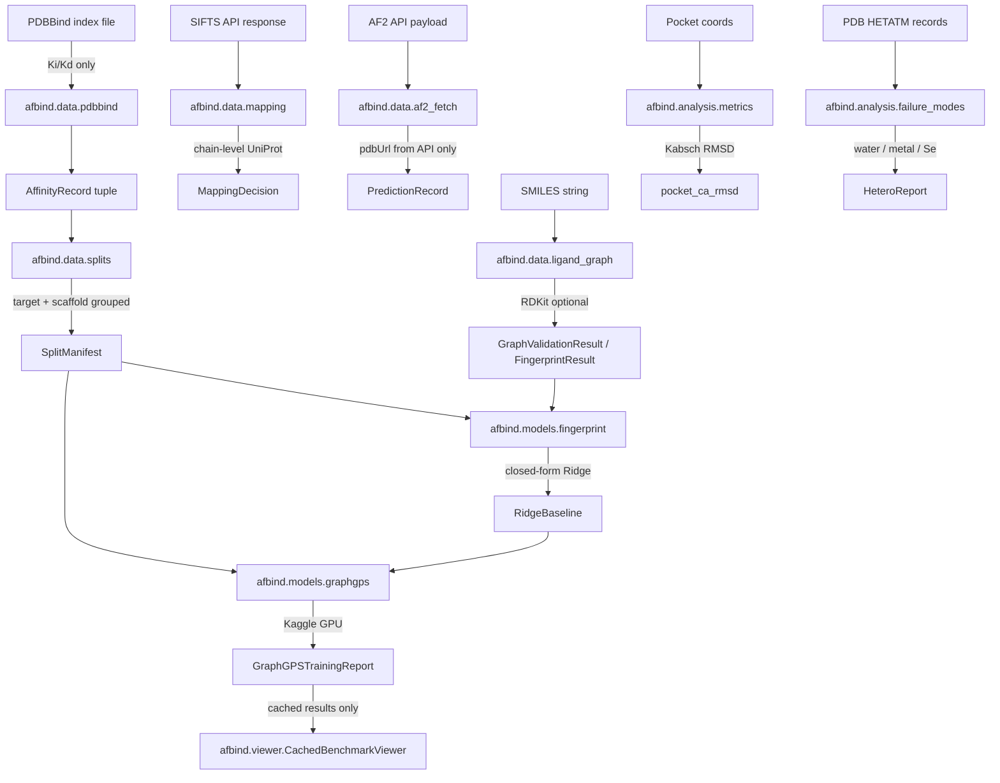

# AlphaFold-Guided Protein–Ligand Binding Benchmark

**Status: offline contracts verified — no real benchmark result exists yet.**

How does replacing experimental co-crystal protein structures with AlphaFold2 predictions
affect protein–ligand binding-affinity prediction on the PDBBind 2020 refined set?

> **Framing note:** This study benchmarks **AlphaFold2** structure substitution. The package is
> named `afbind`. No AlphaFold3 API or model is benchmarked here.

---

## What this measures

- **Labels:** Ki and Kd only, converted to pKi with unit validation. IC50, EC50, Kact, and Ka
  are excluded from all headline results.
- **Split:** Target-grouped and scaffold-grouped manifests are generated before any feature
  normalization or model fitting, preventing leakage across both axes.
- **Baseline:** ECFP6 (Morgan radius 3, 2048 bits) Ridge regression runs before GraphGPS.
- **Graph model:** GraphGPS consuming ligand and pocket graphs. GraphGPS is evaluated as a
  measured model — no performance is assumed in advance.
- **Planned affinity metrics:** Pearson r, Spearman ρ, and pKi RMSE on declared held-out
  records. **None of these values exist yet.** They require a GPU run on approved PDBBind data.
- **Structural diagnostic:** Pocket CA RMSD via Kabsch superposition on matched
  chain/residue/insertion-code keys. Returned as "unavailable" when fewer than three common CA
  residues exist or when the geometry is rank-deficient.

---

## Architecture



---

## Module contracts

| Module | Contract |
|--------|---------|
| `afbind/data/pdbbind.py` | Ki/Kd parsing, unit normalization, pKi conversion, explicit exclusion records |
| `afbind/data/splits.py` | Target-grouped and scaffold-grouped leakage-safe split manifests |
| `afbind/data/af2_fetch.py` | AF2 API-payload handler; selects `pdbUrl` from returned records only — never constructs URLs |
| `afbind/data/mapping.py` | Chain-level UniProt candidate resolution; records ambiguous mappings without guessing |
| `afbind/data/ligand_graph.py` | SMILES shape validator; optional RDKit-backed molecular graph and ECFP6 |
| `afbind/analysis/metrics.py` | Matched CA atom extraction, Kabsch RMSD superposition |
| `afbind/analysis/failure_modes.py` | Heteroatom (water, metal, selenium) evidence scan |
| `afbind/models/fingerprint.py` | Split-aware Ridge baseline (closed-form, no data leakage) |
| `afbind/models/graphgps.py` | GraphGPS regressor + trainer (Kaggle GPU; CPU smoke-tested locally) |
| `afbind/viewer.py` | Cached benchmark record viewer; rejects arbitrary SMILES/UniProt prediction requests |

---

## Installation

**Local development / offline smoke tests (no GPU needed):**

```bash
pip install torch torchvision torchaudio --index-url https://download.pytorch.org/whl/cpu
pip install torch-geometric
pip install -e ".[dev]"
```

**With RDKit (optional — required for real ECFP6 extraction):**

```bash
conda install -c conda-forge rdkit
```

**Kaggle / GPU environment:**

```bash
pip install -r requirements-kaggle.txt
```

---

## Running the tests

```bash
PYTHONDONTWRITEBYTECODE=1 python -m pytest -q -p no:cacheprovider
```

RDKit is not required for the offline suite. Tests that require it use a documented synthetic
adapter and report `dependency_unavailable` when RDKit is absent.

**Verified offline test result (Kaggle, 2026-09-02 UTC):** 37 tests passed, 2 warnings, exit 0.
Python 3.12.13, torch 2.10.0+cpu, torch-geometric 2.8.0.post1.

---

## Running the real benchmark

The real benchmark requires:

1. PDBBind 2020 refined set — register at <https://www.pdbbind.org.cn/>
2. SIFTS API access for chain-level UniProt mapping
3. AlphaFold API access for AF2 structure files
4. A Kaggle (or equivalent GPU) environment

**No benchmark result, checkpoint, or trained model exists in this repository.**

Run order on Kaggle:
1. Parse and validate Ki/Kd labels → `afbind.data.pdbbind`
2. Build target- and scaffold-grouped split manifests → `afbind.data.splits`
3. Fetch SIFTS chain mappings → `afbind.data.mapping`
4. Resolve AF2 `pdbUrl` from API payload → `afbind.data.af2_fetch`
5. Build ligand graphs and ECFP6 fingerprints → `afbind.data.ligand_graph`
6. Compute pocket CA RMSD per record → `afbind.analysis.metrics`
7. Fit Ridge baseline → `afbind.models.fingerprint`
8. Train GraphGPS → `afbind.models.graphgps`

---

## Reproducibility requirements

Any real benchmark result must record:

- PDBBind version, license, access date, and SHA-256 of the index file
- SIFTS and AlphaFold API access dates and response metadata
- Split manifest identity (seed, group policy, record counts, exclusions)
- Package versions, device, and job identifier
- Model configuration and checkpoint SHA-256
- Held-out record IDs, missingness counts, and label exclusion reasons

No result is reportable without these fields.

---

## Limitations

- All tests run against synthetic fixtures — no real PDBBind or AlphaFold data is included.
- The pocket graph depends on the experimental co-crystal ligand pose; AF2 predictions lack
  this pose and require explicit pocket-definition logic before a real substitution run.
- GraphGPS has not been tuned; it is a measured model, not a guaranteed improvement over ECFP6.
- RDKit is required for real ECFP6 extraction and molecular graph construction.
- The future Gradio viewer is limited to cached benchmark records; it is not a docking predictor.

---

## Data and security

- Raw PDBBind, BindingDB, SIFTS, or AlphaFold structure files must not be committed to this
  repository. See `.gitignore` for the enforced exclusion list.
- No real clinical data, patient records, or restricted biomedical data are used or included.
- This codebase does not make diagnostic, clinical efficacy, or production-readiness claims.

---

## License

MIT — see [LICENSE](LICENSE).
